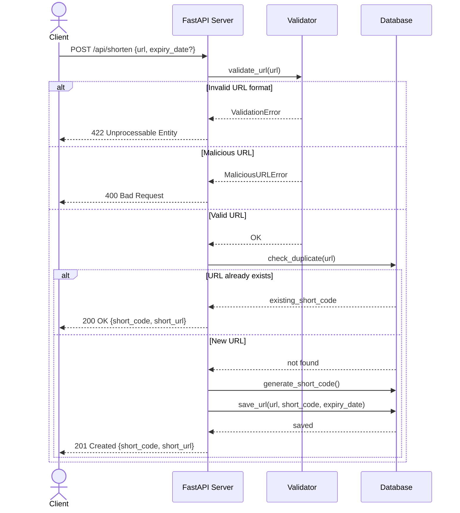
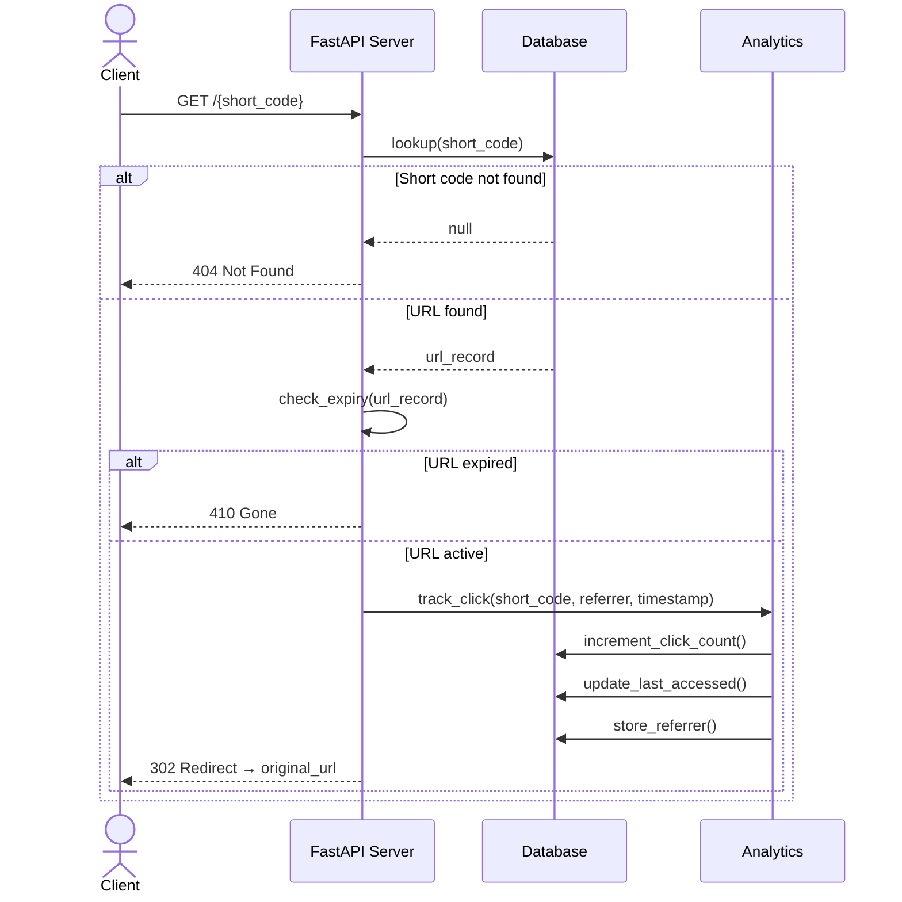

# URL Shortener - Sequence Diagram

## URL Shortening Flow

```mermaid
sequenceDiagram
    actor Client
    participant API as FastAPI Server
    participant VAL as Validator
    participant DB as Database

    Client->>API: POST /api/shorten {url, expiry_date?}
    API->>VAL: validate_url(url)
    
    alt Invalid URL format
        VAL-->>API: ValidationError
        API-->>Client: 422 Unprocessable Entity
    else Malicious URL
        VAL-->>API: MaliciousURLError
        API-->>Client: 400 Bad Request
    else Valid URL
        VAL-->>API: OK
        API->>DB: check_duplicate(url)
        
        alt URL already exists
            DB-->>API: existing_short_code
            API-->>Client: 200 OK {short_code, short_url}
        else New URL
            DB-->>API: not found
            API->>DB: generate_short_code()
            API->>DB: save_url(url, short_code, expiry_date)
            DB-->>API: saved
            API-->>Client: 201 Created {short_code, short_url}
        end
    end
```

## URL Redirect Flow

```mermaid
sequenceDiagram
    actor Client
    participant API as FastAPI Server
    participant DB as Database
    participant ANA as Analytics

    Client->>API: GET /{short_code}
    API->>DB: lookup(short_code)

    alt Short code not found
        DB-->>API: null
        API-->>Client: 404 Not Found
    else URL found
        DB-->>API: url_record
        API->>API: check_expiry(url_record)
        
        alt URL expired
            API-->>Client: 410 Gone
        else URL active
            API->>ANA: track_click(short_code, referrer, timestamp)
            ANA->>DB: increment_click_count()
            ANA->>DB: update_last_accessed()
            ANA->>DB: store_referrer()
            API-->>Client: 302 Redirect → original_url
        end
    end
```